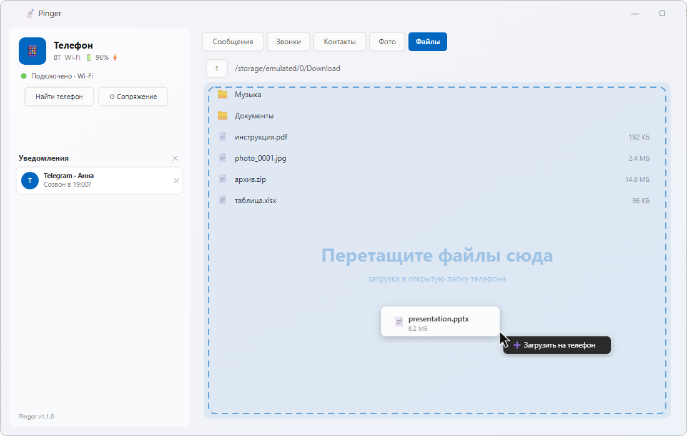
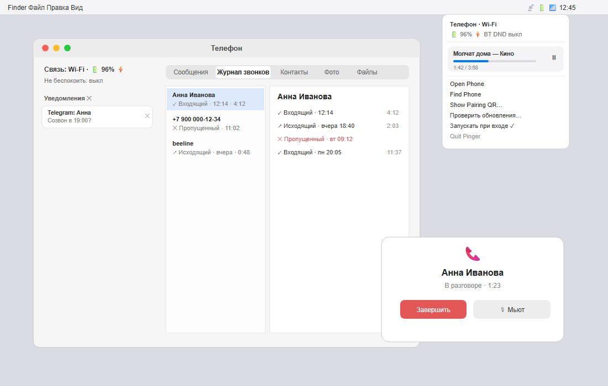
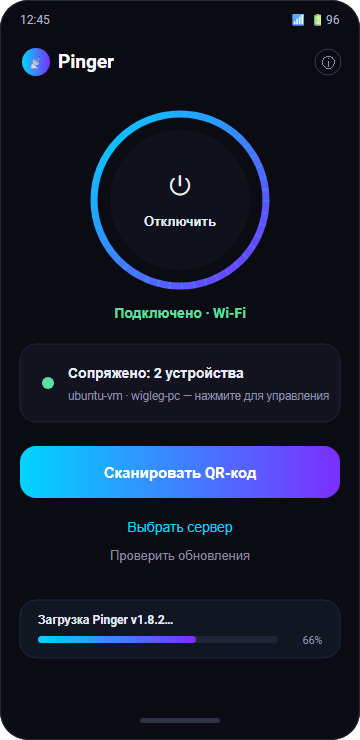

# Pinger

> ## ⚠️ Внимание
> Это ПО написано **полностью с помощью искусственного интеллекта**. Авторы **не несут
> ответственности** за любые проблемы, ущерб или потерю данных. Используйте на свой риск.
>
> This software is written **entirely by AI**. The authors take **no responsibility** for
> any problems, damage or data loss. Use it at your own risk.

---

**Pinger** связывает телефон с компьютером: уведомления (со смахиванием на телефоне), SMS с копированием кодов, звонки и контакты, медиа, файлы и фото —
по Wi-Fi, Bluetooth или через облачный relay (сквозное шифрование).

## Как это выглядит

> Скриншоты интерфейса.

| Windows | Linux |
|---|---|
|  |  |

| macOS | Android |
|---|---|
|  |  |

## Загрузки
Последние сборки — на странице **[Releases](../../releases)**. Клиенты сами проверяют обновления.

## Инструкции по установке
- 📱 **[Android](docs/instructions/Android)** — приложение на телефоне (источник уведомлений/SMS/звонков)
- 🍎 **[macOS](docs/instructions/MacOS)** — клиент для Mac
- 🪟 **[Windows](docs/instructions/Windows)** — клиент для Windows
- 🐧 **[Linux](docs/instructions/Linux)** — клиент для Linux (Ubuntu 24+/Debian 12+)
- ☁️ **[Relay](docs/instructions/Relay)** — облачный relay-сервер (self-host)

В каждом разделе: что это, краткая установка и траблшутинг.

## Лицензия
Распространяется по лицензии **«no buy — go shagay»** ([полный текст](LICENSE.md)).
Коротко: ПО отдаётся **как есть**, без гарантий и без права на претензии; автор не несёт
ответственности за баги и любые последствия — проект делается бесплатно, по вечерам и
под пивасик. Работает — радуйся, не работает — go shagay.

## Как это работает
Телефон (Android) — сервер, отдаёт данные. Компьютеры (macOS/Windows/Linux) — клиенты: подключаются и показывают. Сопряжение по QR (клиент показывает, телефон сканирует). Транспорт: Wi-Fi (mDNS) → Bluetooth LE → облачный relay; приоритет у локальной связи. Relay — опциональный self-host для облачного транспорта, когда нет общей сети/Bluetooth.
