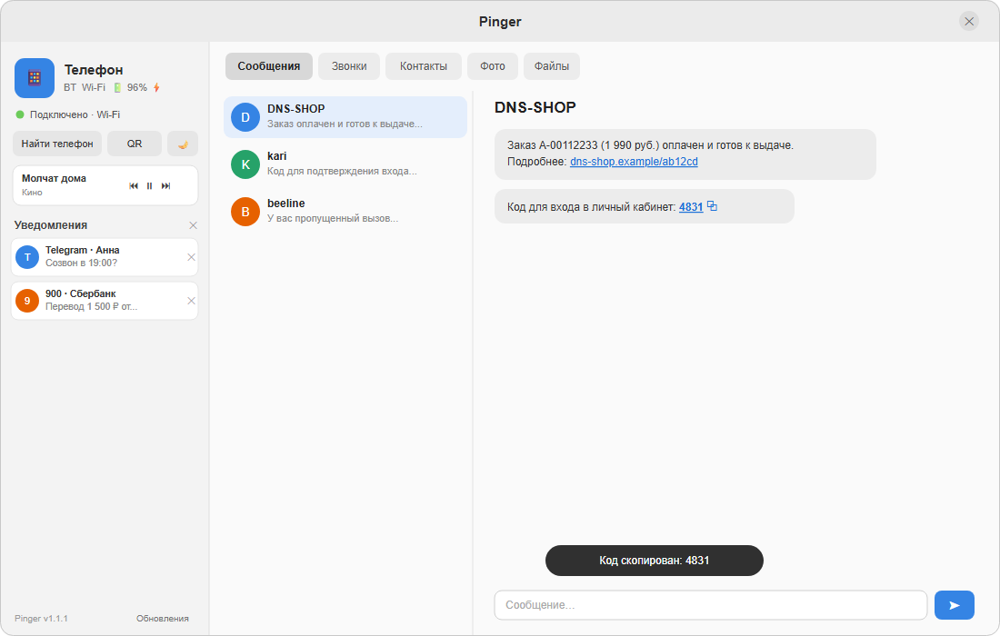

# Pinger для Linux

## О приложении
Нативный клиент Pinger для Linux (Rust + GTK4/libadwaita, один бинарь ~6 МБ). Паритет с
macOS/Windows: уведомления (с «смахиванием» на телефоне), SMS-треды с кодами и ссылками,
журнал звонков тредами, контакты, фото и файлы (кнопки Скачать/Загрузить), медиа,
DND-тоггл, трей со статусами, автозапуск, обновления внутри приложения. Подключается по
Wi-Fi, Bluetooth (BlueZ) или через облачный relay.

**Требования:** Ubuntu 24.04+ / Debian 12+ (GTK4 ≥ 4.12, libadwaita ≥ 1.4, BlueZ).



## Установка

**Вариант 1 — .deb (рекомендуется):**
```bash
sudo apt install ./pinger_X.Y.Z_amd64.deb
```
Зависимости — только системные библиотеки (libgtk-4-1, libadwaita-1-0, bluez).

**Вариант 2 — бинарь:**
```bash
chmod +x pinger && ./pinger
```

Подключение: кнопка «QR-сопряжение» → на телефоне «Сканировать QR-код». Relay (для связи
вне общей сети) — поле в том же диалоге, либо переменная `PINGER_SERVER`.

При первом запуске включается автозапуск при входе (отключается в меню трея —
«Запускать при входе»).

## Траблшутинг
- **Нет иконки в трее (GNOME)** — поставь расширение AppIndicator:
  `sudo apt install gnome-shell-extension-appindicator`, перелогинься. KDE/XFCE — работает из коробки.
- **Пустое/чёрное окно в виртуалке** — нет GPU; запускай `GSK_RENDERER=cairo pinger`.
- **BLE не находит телефон** — проверь `systemctl status bluetooth`; в VM Bluetooth обычно
  недоступен — используй Wi-Fi или relay.
- **«Нет соединения» во вкладках Фото/Файлы** — вкладка открыта до подключения; вернись
  на неё после установления связи (перезагружается автоматически).
- **Не подключается** — телефон и ПК в одной Wi-Fi-сети, либо задай relay. Переподключиться:
  трей → «Переподключиться».
- **Второй запуск ничего не делает** — приложение одно-экземплярное: повторный запуск
  поднимает существующее окно (ищи его в трее).
